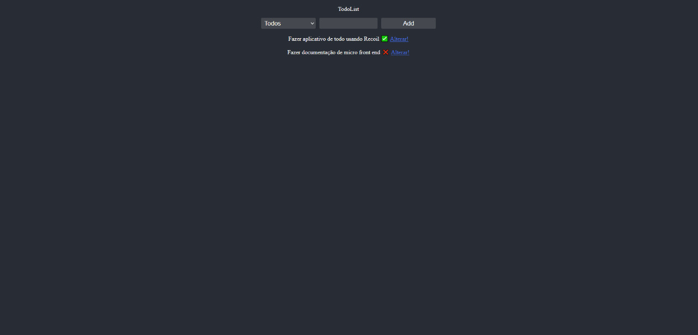

# todoList Básico

Aplicação criada para treinar funcionamento do Recoil

## Tecnologias utilizadas 🚀 :
- [Recoil]('https://recoiljs.org/docs/introduction/getting-started')
- [Vite]('https://vitejs.dev/guide/')

## Como rodar a Aplicação:

- Para instalar as dependências 

```
yarn
```

- Para rodar o projeto
```
yarn run dev
```

- Aplicação rodando na porta 3000

## 🔧 Funções

### Função 01:

- Adicionar uma nova tarefa

### Função 02:

- Atualizar estado para completada ou não completada